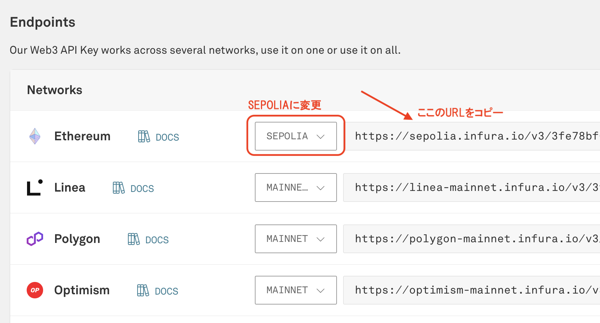
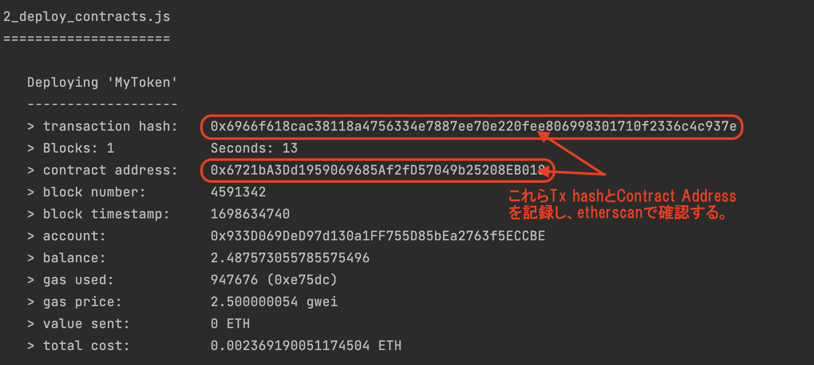
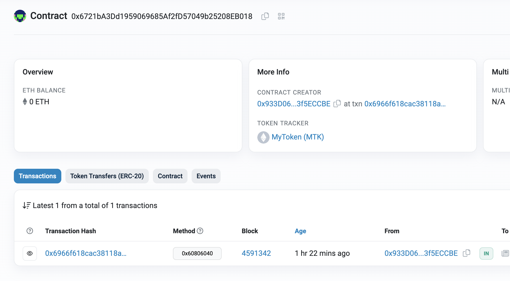

このドキュメントでは作成したMyTokenをSepoliaテストネットにデプロイする手順を説明します。
Sepoliaテストネットにデプロイするためには手数料となるSepoliaETHが必要です。そのため、まず最初にWalletアプリであるMetamaskをインストールし、SepoliaETHを入手する手順を説明します。

次に、Sepoliaに接続するためにInfura.ioのサービスに登録して利用する手段を説明します。

最後にTruffleにSepoliaと接続するためのネットワーク設定と、Infura.ioとMetamaskのアカウントを利用する設定を追加して、SepoliaにMyTokenをデプロイする手順を説明します。

### 1. **ChromeにMetamaskプラグインをインストール**:
   - [Metamaskの公式ウェブサイト](https://metamask.io/download.html)またはChromeウェブストアからMetamaskプラグインをダウンロードしてインストールします。
   - Metamaskを開き、アカウントを作成します。アカウント作成時に表示されるmnemonic（12の単語）をメモしておきます。このmnemonicは後でHDWalletProviderの設定に使用します。

### 2. **SepoliaテストネットのfaucetからETHを入手**:
   - MetamaskでSepoliaテストネットを選択します。
   - [Sepolia faucet](https://sepoliafaucet.com/)にアクセスし、Metamaskのアドレスを入力してETHをリクエストします。注意: このfaucetは1日1回しかETHを入手できないため、必要に応じて計画的に行動してください。

### 3. **Infura.ioのアカウントを作成**:
- [Infura.io](https://infura.io/) にアクセスし、新しいアカウントを作成します。
- アカウント作成後、Infuraダッシュボードで新しいプロジェクトを作成し、プロジェクトのエンドポイントURLをコピーします。
  

### 4. **truffle-config.jsonにSepoliaテストネットのネットワーク情報を追加**:
   - `truffle-config.json` ファイルをエディタで開き、以下のようにSepoliaネットワークの設定を追加します。
   - `module.export: `の前に HDWalletProviderの定義を追加
   - `networks: `に`sepolia`のネットワーク設定を追加

```javascript
const HDWalletProvider = require('@truffle/hdwallet-provider');

module.exports = {
  // コメント部分なので省略...
  networks: {
    sepolia: {
      provider: () => new HDWalletProvider(
        "your mnemonic goes here", // ここにMetamaskのmnemonicを直接指定
        "https://sepolia.infura.io/v3/<your-project-secret>"  // InfuraのSepoliaエンドポイントURLを指定
      ),
      network_id: 11155111,       // SepoliaのネットワークID
      gas: 1000000,             // Gas limitを指定
    },
    // ↑のブロックをコピー＆ペーストして追加する。
  },
  // ...他のconfig設定
};
```

### 5. **truffleコマンドを用いてSepoliaにMyTokenをデプロイ**:
 
- ターミナルを開き、packages/contractsに移動します。
- 以下のコマンドを実行して`@truffle/hdwallet-provider`モジュールをインストールします。
- その次のコマンドでMyTokenをSepoliaテストネットにデプロイします。

```bash
$ yarn add --dev @truffle/hdwallet-provider
$ yarn truffle migrate --network sepolia
```

- ターミナルに表示されるログから、Transaction HashとContract Addressをメモしておく。



### 6. **etherscanで確認**:
- [Sepolia Testnet Etherscan](https://sepolia.etherscan.io/)にアクセスし、Transaction HashまたはContract Addressを使ってデプロイメントを確認します。


