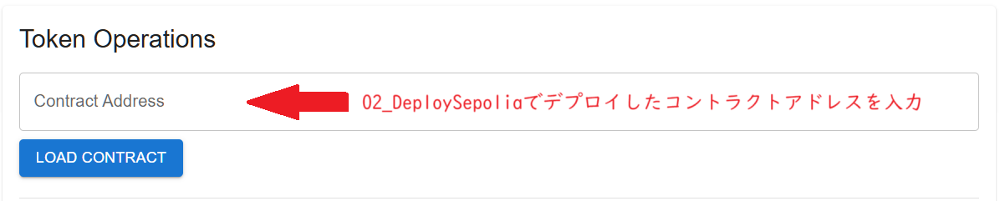
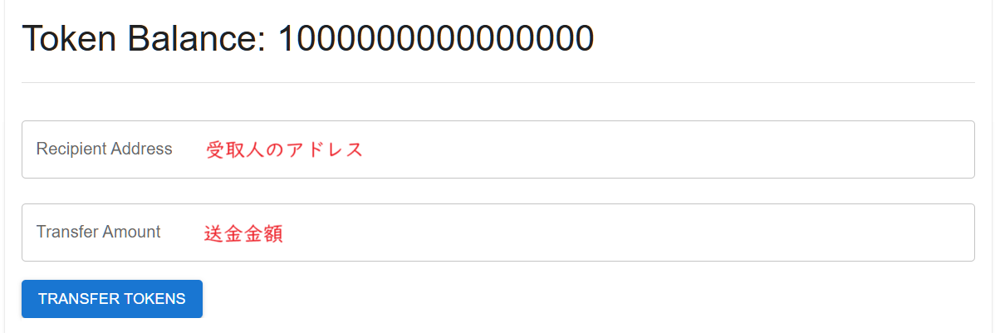

# 4: ERC20Token Dappsの実装

ERC20 Tokenの残高確認と送金ができる機能を持つDappsの作成方法について説明します。
なお、事前に以下の手順に従ってERC20Token Contractの作成とデプロイ、それからシンプルなDappsを作成済みである前提で進めます。

- [1.ERC20Token Contractの作成](./1_CreateERC20Token.md)
- [2.SepoliaテストネットにContractをデプロイ](./2_DeploySepolia.md)
- [3.SimpleなDappsの作成](./3_CreateSimpleDapps.md)

これらの手順は全て、`packages/front`以下で作業する想定で記載しております。

## 1. Web3.jsのインストール
```bash
yarn add @nomicfoundation/hardhat-web3-v4
```

## 2. **ERC20トークンのABIの保存**:

まず最初に、`src/contracts`ディレクトリを作成し、その中にhardhatで生成された`../contracts/artifacts/contracts/MyToken.sol/MyToken.json`をコピーします。

この`MyToken.json`ファイルの中に、Javascriptやその他のクライアントライブラリからContractにアクセスするためのインターフェース情報（メソッド名やメソッドのID、必要なパラメータ情報など）が含まれています。これらの情報のことをABI（Application Binary Interface)と呼びます。

以下のコマンドを実行してディレクトリを作成し、`MyToken.json`ファイルをコピーしてください。

```bash
mkdir src/contracts
cp ../contracts/artifacts/contracts/MyToken.sol/MyToken.json src/contracts/
```

なお、ERC20はインターフェース仕様が標準化されているため、以下の内容でファイルを直接生成しても良いです。

**src/contracts/MyToken.json**
```json
{
  "abi": [
    {
      "constant": true,
      "inputs": [],
      "name": "name",
      "outputs": [{ "name": "", "type": "string" }],
      "payable": false,
      "stateMutability": "view",
      "type": "function"
    },
    {
      "constant": false,
      "inputs": [
        { "name": "_spender", "type": "address" },
        { "name": "_value", "type": "uint256" }
      ],
      "name": "approve",
      "outputs": [{ "name": "", "type": "bool" }],
      "payable": false,
      "stateMutability": "nonpayable",
      "type": "function"
    },
    {
      "constant": true,
      "inputs": [],
      "name": "totalSupply",
      "outputs": [{ "name": "", "type": "uint256" }],
      "payable": false,
      "stateMutability": "view",
      "type": "function"
    },
    {
      "constant": false,
      "inputs": [
        { "name": "_from", "type": "address" },
        { "name": "_to", "type": "address" },
        { "name": "_value", "type": "uint256" }
      ],
      "name": "transferFrom",
      "outputs": [{ "name": "", "type": "bool" }],
      "payable": false,
      "stateMutability": "nonpayable",
      "type": "function"
    },
    {
      "constant": true,
      "inputs": [],
      "name": "decimals",
      "outputs": [{ "name": "", "type": "uint8" }],
      "payable": false,
      "stateMutability": "view",
      "type": "function"
    },
    {
      "constant": true,
      "inputs": [{ "name": "_owner", "type": "address" }],
      "name": "balanceOf",
      "outputs": [{ "name": "balance", "type": "uint256" }],
      "payable": false,
      "stateMutability": "view",
      "type": "function"
    },
    {
      "constant": true,
      "inputs": [],
      "name": "symbol",
      "outputs": [{ "name": "", "type": "string" }],
      "payable": false,
      "stateMutability": "view",
      "type": "function"
    },
    {
      "constant": false,
      "inputs": [
        { "name": "_to", "type": "address" },
        { "name": "_value", "type": "uint256" }
      ],
      "name": "transfer",
      "outputs": [{ "name": "", "type": "bool" }],
      "payable": false,
      "stateMutability": "nonpayable",
      "type": "function"
    },
    {
      "constant": true,
      "inputs": [
        { "name": "_owner", "type": "address" },
        { "name": "_spender", "type": "address" }
      ],
      "name": "allowance",
      "outputs": [{ "name": "", "type": "uint256" }],
      "payable": false,
      "stateMutability": "view",
      "type": "function"
    },
    {
      "inputs": [
        { "name": "_initialAmount", "type": "uint256" },
        { "name": "_tokenName", "type": "string" },
        { "name": "_decimalUnits", "type": "uint8" },
        { "name": "_tokenSymbol", "type": "string" }
      ],
      "payable": false,
      "stateMutability": "nonpayable",
      "type": "constructor"
    },
    {
      "anonymous": false,
      "inputs": [
        { "indexed": true, "name": "_from", "type": "address" },
        { "indexed": true, "name": "_to", "type": "address" },
        { "indexed": false, "name": "_value", "type": "uint256" }
      ],
      "name": "Transfer",
      "type": "event"
    },
    {
      "anonymous": false,
      "inputs": [
        { "indexed": true, "name": "_owner", "type": "address" },
        { "indexed": true, "name": "_spender", "type": "address" },
        { "indexed": false, "name": "_value", "type": "uint256" }
      ],
      "name": "Approval",
      "type": "event"
    }
  ]
}
```

## 3. **ERC20Tokenの管理機能を持つ新しいコンポーネントの作成**:

次に、`src/components`ディレクトリ内に`TokenComponent.js`という新しいファイルを作成します。

このコンポーネントではERC20Token Contractを操作するための簡単な以下の２つの機能を実装します。
- 指定されたERC20Tokenの残高を表示
- 指定されたERC20Tokenを送金

以下の内容を`TokenComponent.js`ファイルに貼り付けてください。

**src/components/TokenComponent.js**
```javascript
import React, { useState } from 'react';
import { useSDK } from '@metamask/sdk-react';
import Web3 from 'web3';

import { Button, Card, CardContent, TextField, Typography, Divider, List, ListSubheader, ListItem } from '@mui/material';
import MyToken from '../contracts/MyToken.json';  // Assume the path to MyToken.json is correct

function TokenComponent() {
    const { connected, provider, account } = useSDK();
    const [contractAddress, setContractAddress] = useState('');
    const [recipientAddress, setRecipientAddress] = useState('');
    const [transferAmount, setTransferAmount] = useState('');
    const [tokenBalance, setTokenBalance] = useState(null);
    const [transactionHashes, setTransactionHashes] = useState([]);

    const loadContract = async () => {
        if (connected && provider && contractAddress) {
            const web3 = new Web3(provider);
            const contract = new web3.eth.Contract(MyToken.abi, contractAddress);
            try {
                const balance = await contract.methods.balanceOf(account).call();
                setTokenBalance(balance);
            } catch (error) {
                console.error('Error fetching token balance:', error);
                alert('Error fetching token balance');
            }
        }
    };

    const handleTransfer = async () => {
        if (connected && provider && contractAddress && recipientAddress && transferAmount) {
            const web3 = new Web3(provider);
            const contract = new web3.eth.Contract(MyToken.abi, contractAddress);
            try {
                const calldata = contract.methods.transfer(recipientAddress, transferAmount).encodeABI()
                const result = await contract.methods.transfer(recipientAddress, transferAmount)
                    .send({ from: account, data: calldata }); // data param is workaround.
                console.log(result)
                setTransactionHashes(prevHashes => [...prevHashes, result.transactionHash]);  // Update transaction hashes
            } catch (error) {
                console.error('Error executing transfer:', error);
            }
        }
    };

    return (
        <div style={{marginTop: '20px' }}>
            <Card>
                <CardContent>
                    <Typography variant="h5">Token Operations</Typography>
                    <TextField
                        label="Contract Address"
                        value={contractAddress}
                        onChange={(e) => setContractAddress(e.target.value)}
                        fullWidth
                        margin="normal"
                    />
                    <Button variant="contained" color="primary" onClick={loadContract}>
                        Load Contract
                    </Button>
                    <Divider style={{ margin: '20px 0' }} />
                    {tokenBalance !== null && (
                        <div>
                            <Typography variant="h4" style={{ marginBottom: '20px' }}>
                                Token Balance: {tokenBalance.toString()}
                            </Typography>
                            <Divider style={{ margin: '20px 0' }} />
                            <TextField
                                label="Recipient Address"
                                value={recipientAddress}
                                onChange={(e) => setRecipientAddress(e.target.value)}
                                fullWidth
                                margin="normal"
                            />
                            <TextField
                                label="Transfer Amount"
                                value={transferAmount}
                                onChange={(e) => setTransferAmount(e.target.value)}
                                fullWidth
                                margin="normal"
                            />
                            <Button variant="contained" color="primary" onClick={handleTransfer} style={{ marginTop: '10px' }}>
                                Transfer Tokens
                            </Button>
                            {transactionHashes.length > 0 && (
                                <List
                                    subheader={
                                        <ListSubheader>
                                            Transaction Hashes:
                                        </ListSubheader>
                                    }>
                                    {transactionHashes.map((hash, index) => (
                                        <ListItem key={index}>
                                            <Typography variant="body1">
                                                <a
                                                    href={`https://sepolia.etherscan.io/tx/${hash}`}
                                                    target="_blank"
                                                    rel="noopener noreferrer"
                                                >
                                                    {hash}
                                                </a>
                                            </Typography>
                                        </ListItem>
                                    ))}
                                </List>
                            )}
                        </div>
                    )}
                </CardContent>
            </Card>
        </div>
    );
}

export default TokenComponent;
```

### 3-1.コードの簡単な説明：

loadContractメソッドを定義して、このメソッドのなかでERC20Token Contractに接続しています。ここではTokenの残高を取得しています。ContractへのやりとりはWeb3ライブラリを利用しています。Web3ライブラリにMetamaskが提供する`provider`を指定することでweb3ライブラリとMetamaskが連携して動作できるようになります。

loadContractメソッドは`Contract Address`を入力して、`Load Contract`ボタンが押されたときに実行されます。



```Javascript
//... 省略 ...
    const loadContract = async () => {
        if (connected && provider && contractAddress) {
            const web3 = new Web3(provider);
            const contract = new web3.eth.Contract(MyToken.abi, contractAddress);
            try {
                const balance = await contract.methods.balanceOf(account).call();
                setTokenBalance(balance);
            } catch (error) {
                console.error('Error fetching token balance:', error);
                alert('Error fetching token balance');
            }
        }
    };
//... 省略 ...
return (
//... 省略 ...
                <TextField
                    label="Transfer Amount"
                    value={transferAmount}
                    onChange={(e) => setTransferAmount(e.target.value)}
                    fullWidth
                    margin="normal"
                />
                <Button variant="contained" color="primary" onClick={handleTransfer} style={{ marginTop: '10px' }}>
                    Transfer Tokens
                </Button>
//... 省略 ...
```

`handleTransfer`メソッドでERC20Tokenを送金する処理を実装しています。このメソッドは送信先相手の`recipientAddress`と送金する数量の`transferAmount`を指定して、`ERC20Token Contract`の`transfer`メソッドを呼び出しています。

この処理は、Ethereumのstateの変更が必要となるため、Ethereum上にTransactionがブロードキャストされます。そのため、Transaction実行に必要な手数料が請求されます。
`Transfer Tokens`ボタンを押すと手数料支払いのためにMetamaskが起動して署名の確認が行われます。Metamaskの起動などの処理は全て、Web3ライブラリとMetamaskのライブラリによって自動的に行われています。



```Javascript
//... 省略 ...
    const handleTransfer = async () => {
        if (connected && provider && contractAddress && recipientAddress && transferAmount) {
            const web3 = new Web3(provider);
            const contract = new web3.eth.Contract(MyToken.abi, contractAddress);
            try {
                const calldata = contract.methods.transfer(recipientAddress, transferAmount).encodeABI()
                const result = await contract.methods.transfer(recipientAddress, transferAmount)
                    .send({ from: account, data: calldata }); // data param is workaround.
                console.log(result)
                setTransactionHashes(prevHashes => [...prevHashes, result.transactionHash]);  // Update transaction hashes
            } catch (error) {
                console.error('Error executing transfer:', error);
            }
        }
    };
//... 省略 ...
return (
//... 省略 ...
                <TextField
                    label="Recipient Address"
                    value={recipientAddress}
                    onChange={(e) => setRecipientAddress(e.target.value)}
                    fullWidth
                    margin="normal"
                />
                <TextField
                    label="Transfer Amount"
                    value={transferAmount}
                    onChange={(e) => setTransferAmount(e.target.value)}
                    fullWidth
                    margin="normal"
                />
                <Button variant="contained" color="primary" onClick={handleTransfer} style={{ marginTop: '10px' }}>
                    Transfer Tokens
                </Button>
//... 省略 ...
```

最後に、Transactionが無事に発行されると画面上に発行したTransactionのhashを表示しています。ここではTransactionの詳細が確認できるように`etherscan`へのリンクをつけています。
```Javascript
//... 省略 ...
return (
//... 省略 ...
                            {transactionHashes.length > 0 && (
                                <List
                                    subheader={
                                        <ListSubheader>
                                            Transaction Hashes:
                                        </ListSubheader>
                                    }>
                                    {transactionHashes.map((hash, index) => (
                                        <ListItem key={index}>
                                            <Typography variant="body1">
                                                <a
                                                    href={`https://sepolia.etherscan.io/tx/${hash}`}
                                                    target="_blank"
                                                    rel="noopener noreferrer"
                                                >
                                                    {hash}
                                                </a>
                                            </Typography>
                                        </ListItem>
                                    ))}
                                </List>
                            )}
//... 省略 ...
```

## 4. **Homeコンポーネントの更新**:

最後に、`Home.js`ファイルを更新して、新しく作成した`TokenComponent`をインポートし、レンダリングします。

**/src/components/Home.js**
```javascript
import React from 'react';
import { useSDK } from '@metamask/sdk-react';
import { Button, Card, CardContent, Typography } from '@mui/material';
import BigNumber from 'bignumber.js';
import TokenComponent from './TokenComponent';  // Add this line

function Home() {
  const { sdk, connected, connecting, provider, chainId, account, balance } = useSDK();

  const connect = async () => {
    if (!connected && !connecting && sdk) {
      await sdk.connect();
    }
  };

  const weiToEth = (wei) => {
    const weiBN = new BigNumber(wei.substring(2), 16);  // Convert hex string to BN instance
    const divisor = new BigNumber(10).pow(new BigNumber(18));  // 1 Ether = 10^18 Wei
    return weiBN.div(divisor).decimalPlaces(5);  // Convert Wei to Ether
  };

  const formattedBalance = balance ? weiToEth(balance) : null;

  return (
    <div style={{ padding: '20px' }}>
      <Button variant="contained" color="primary" onClick={connect} disabled={connected || connecting}>
        Connect to MetaMask
      </Button>
      {connected && account && (
        <Card style={{ marginTop: '20px' }}>
          <CardContent>
            <Typography variant="h5">Account Details</Typography>
            <Typography variant="body1">Address: {account}</Typography>
            <Typography variant="body1">Balance: {formattedBalance ? `${formattedBalance} ETH` : 'Loading...'}</Typography>
          </CardContent>
        </Card>
      )}
      <TokenComponent />  {/* Add this line */}
    </div>
  );
}

export default Home;
```

以上で、ReactアプリケーションにERC20トークンの操作機能を追加する手順が完了しました。最後に、アプリケーションを実行して、更新が正しく機能することを確認します。

```bash
yarn start
```

[3.SimpleなDappsの作成](./3_CreateSimpleDapps.md) &lt;&lt;prev 